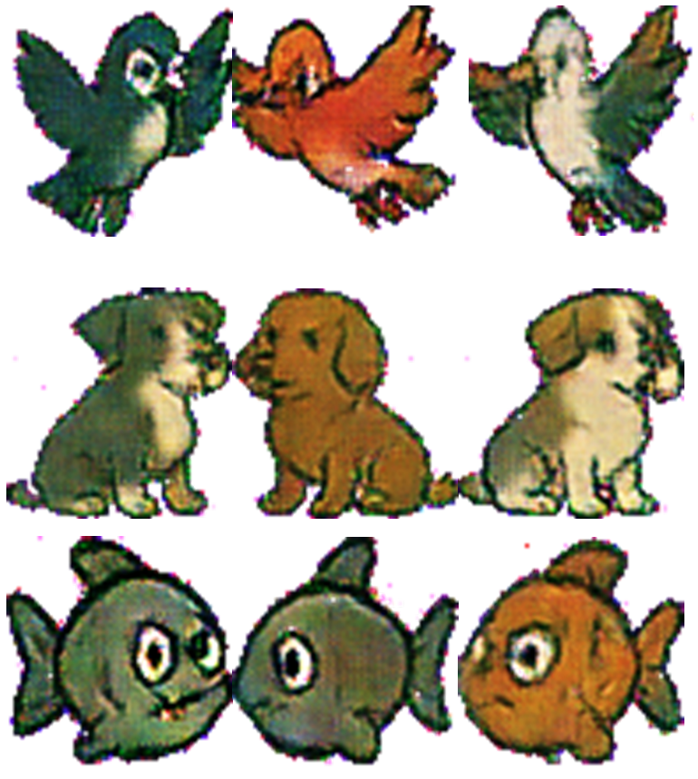
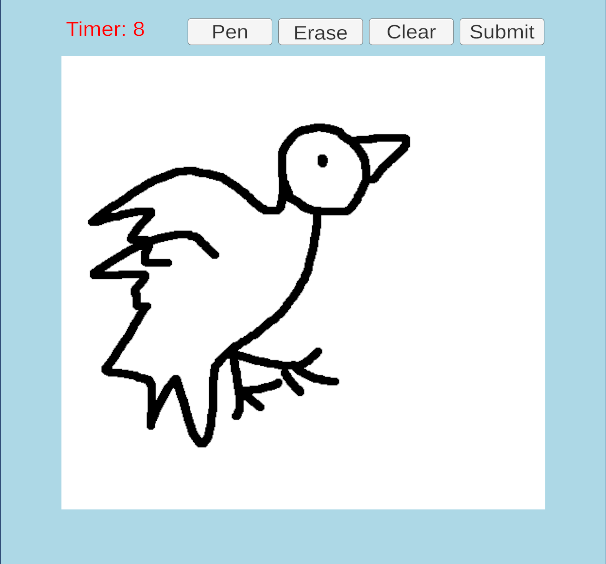
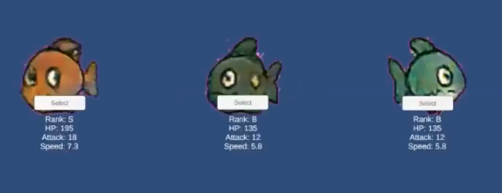
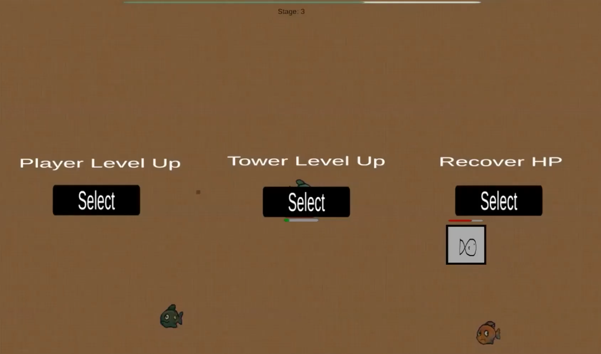
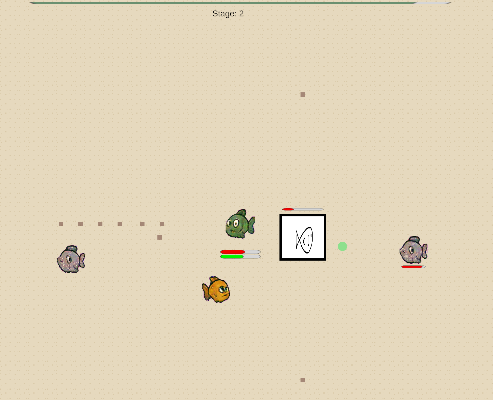
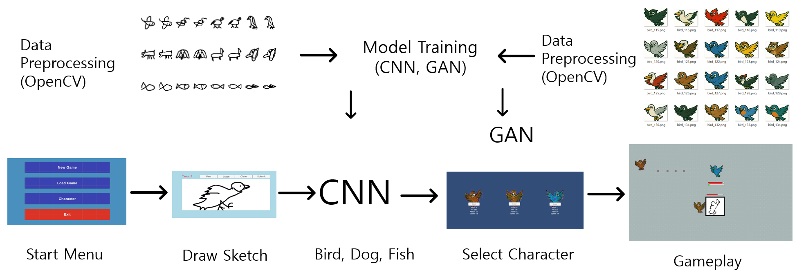
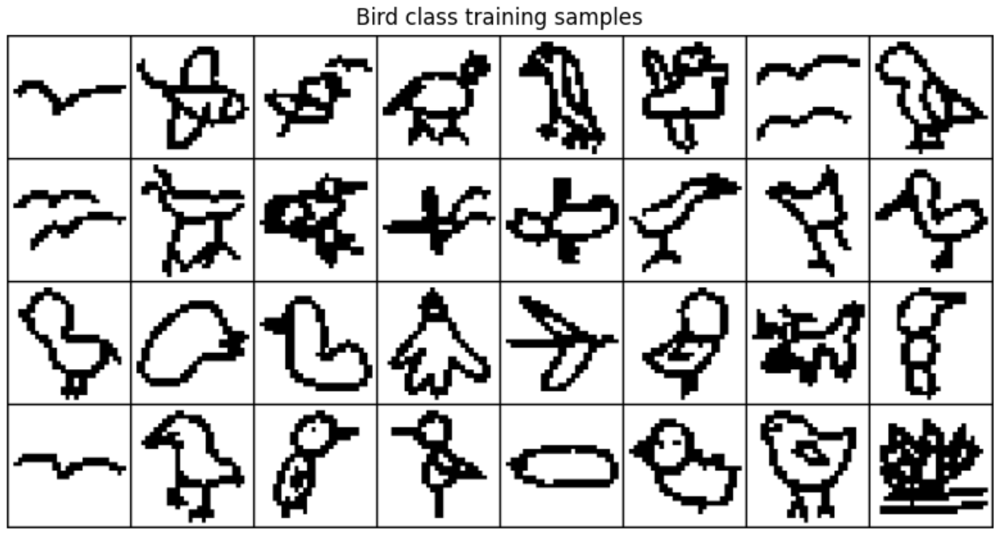
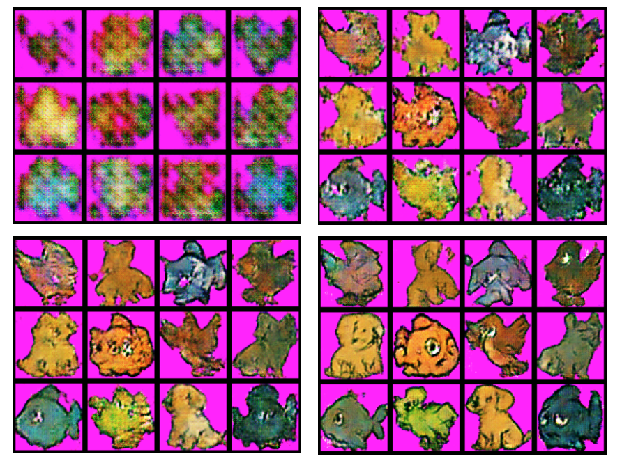
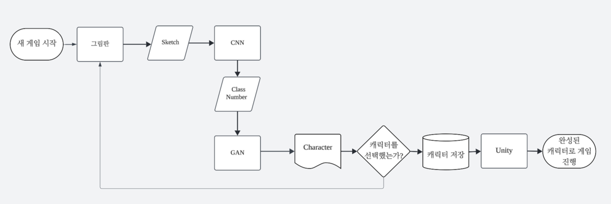
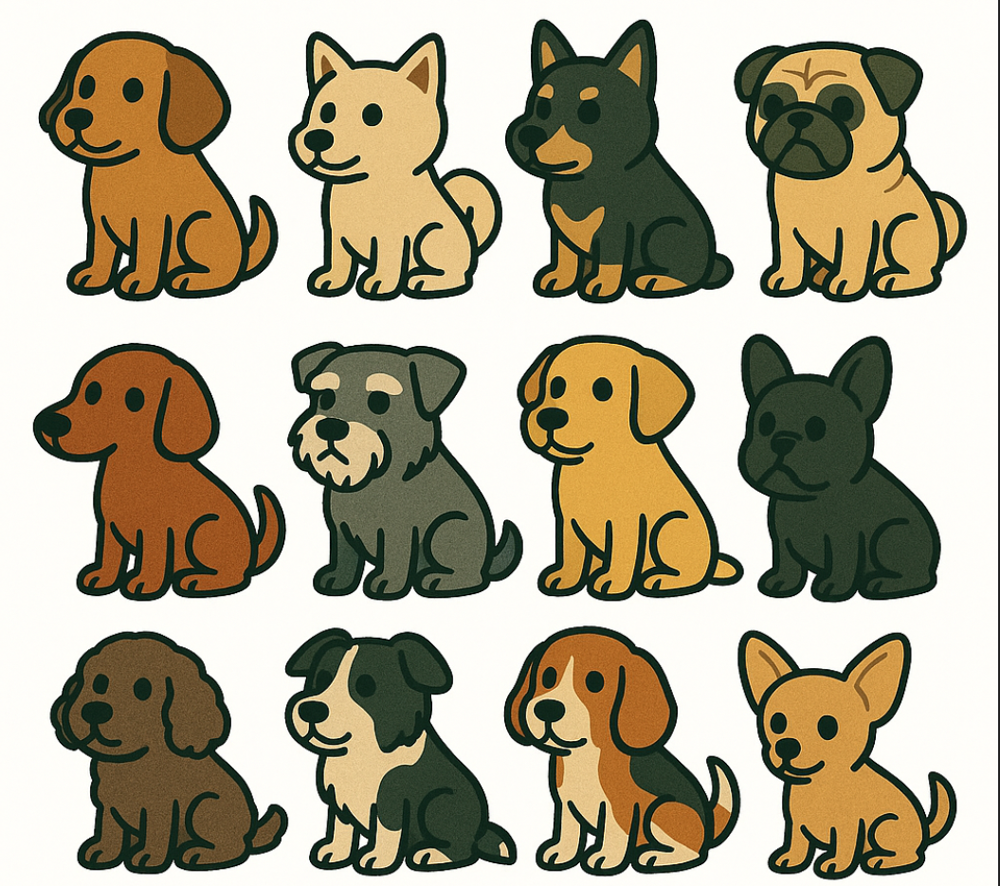

# SketchMonster
A 2D top-down roguelike game where player drawings are analyzed by AI(CNN, GAN) to generate unique monster characters for gameplay. Built with Unity and Sentis engine.

# 프로젝트 소개
SketchMonster는 생성형 AI를 게임에 통합한 2D 로그라이크 게임입니다.

사용자가 간단한 스케치를 그리면 캐릭터를 생성합니다.
1. CNN 모델이 스케치의 종류를 Bird, Dog, Fish 중 하나로 분류
2. GAN 모델이 해당 클래스의 캐릭터 이미지를 생성
3. 클래스와 스케치 과정에 따라 고유한 능력치 부여

생성된 캐릭터로 즉시 게임을 플레이할 수 있으며 CNN, GAN 모델은 onnx 포맷으로 변환되어 추론은 Unity Inference Engine으로 오프라인에서 실행됩니다.


*Character Sample*

## 캐릭터 생성

확률에 따라 등급이 부여되고 등급, 종류, 스케치 과정에 따라 능력치가 결정됩니다.
- Grade: S/A/B/C (10/30/40/20)
- Class: Bird(빠른 Speed, 낮은 HP), Dog(밸런스 형), Fish(느린 Speed, 높은 HP)
- Sketch: 많은 획으로 그려진 스케치를 통해 생성된 캐릭터는 높은 HP 보너스 스탯, 빠른 시간 안에 그려진 스케치를 통해 생성된 캐릭터는 높은 Speed 보너스 스탯

최종 능력치 = Class별 기본값 * 등급 계수 + 추가 능력치
- HP 추가 능력치 = StrokeCount * 추가 능력치 계수
- Speed 추가 능력치 = RemainTime * 추가 능력치 계수

Generator가 생성한 이미지를 외형으로 하며 최종 계산된 능력치를 적용하여 다양한 캐릭터를 생성합니다.
자신이 생성한 캐릭터가 등장하는 2D 로그라이크 게임을 플레이 할 수 있습니다.

# 게임 목표

게임은 맵 중앙의 Main Tower와 플레이어 캐릭터를 지키며 최대한 오래 생존하는 것을 목표로 합니다.

## 게임 진행

맵 외곽에서 생성된 적들은 Main Tower와 플레이어 캐릭터 중 더 가까운 대상을 추적합니다.
화면 상단의 진행도 게이지가 끝까지 차오르면(60초) 해당 스테이지가 클리어되며 다음 스테이지로 넘어갈 수 있습니다.
스테이지가 진행될수록 강한 적들이 생성되며 플레이어 역시 처치한 적이 떨어트리는 경험치를 획득해 강화할 수 있습니다.

## 성장 시스템

적을 처치하고 경험치를 모아 레벨업
레벨업 시 3가지 선택지 중 1개 선택
- Player 능력치 강화
- Tower 능력치 강화
- HP 회복

## 게임 오버

적과 충돌해 Main Tower 또는 Player의 HP가 0이 되면 게임 오버

## 플레이 방법

### 1. 스케치 그리기

메인 메뉴에서 New Game 버튼을 눌러 그림판으로 이동합니다.
주어진 시간 안에 자신의 스케치를 그립니다. (20초)
지원 Class: Bird, Dog, Fish
도구
- Pen: 그리기 모드
- Erase: 지우개
- Clear: 전체 삭제
- Submit: 제출 (타이머 종료 전에 제출 가능)
Remain Time: Speed 추가
Stroke Count: HP 추가


*Sketch Sample*

### 2. 캐릭터 선택

3개의 캐릭터가 생성됩니다.

**캐릭터 정보**
- 외형
- Grade
- HP, Attack, Speed

플레이 하고 싶은 캐릭터를 선택합니다.
타이머 종료로 원치 않게 제출되었거나 마음에 들지 않을 경우 Restart 버튼을 눌러 그림판으로 복귀


*Select Sample*

### 3. 게임 플레이

선택한 캐릭터로 게임을 플레이합니다.
레벨업 보상을 적절히 활용해 중앙의 Main Tower를 지키며 최대한 오랫동안 생존을 목표로 합니다.

## 조작법
- `방향키` 캐릭터 이동
- `Space` 기본 공격 (바라보는 방향으로 투사체 발사)
(Class 별 고유 스킬 추가 예정)

**게임 요소**
- 적은 외곽에서 생성되어 Main Tower와 Player 중 가까운 대상을 추적
- Main Tower 또는 Player의 HP가 0이 되면 Game Over
- 스테이지가 진행될수록 적의 생성 주기와 능력치 상승
- 적 처치 시 경험치 구슬 드롭
- 레벨업 시 선택지 제시


*Levelup Sample*


*Gameplay Sample*

# System Architecture


*Architecture*

## Training Phase

**데이터 수집 및 전처리**

**CNN**
Google Quickdraw(5000 X 3)
손그림 스타일 스케치


*CNN Data Sample*

**GAN**
DALL-E(300 X 5증강 X 3)
윤곽선이 뚜렷한 cartoon 스타일 유지


*GAN Data Sample*

**모델 학습**
Bird, Dog, Fish 스케치를 구별하도록 CNN학습
CNN이 구별 가능한 class 각각의 캐릭터 이미지를 통일성 있는 스타일로 GAN 학습
Magenta 배경 적용


*Train Sample*

**ONNX 변환**
학습이 완료된 CNN과 Generator를 Unity 환경에서 사용 가능하도록 onnx 포맷으로 변환

## Game Phase

**Start Menu**
- 새 게임 시작
- 게임 종료
- (미구현: 진행 중이던 게임 불러오기, 이전에 생성한 캐릭터 관리)

**Draw Sketch**
- 그림판에 원하는 스케치를 그림
- 20초 타이머
- Stroke Count, Remain Time 저장

**CNN Classification**
- 사용자의 스케치를 CNN모델이 구별

**GAN Generation**
- CNN모델이 구별한 결과를 바탕으로 캐릭터 이미지 생성

**Select Character**
- 생성된 이미지와 스케치를 바탕으로 부여된 능력치를 보유한 완성된 캐릭터를 선택
- 선택된 캐릭터 정보는 json, png파일로 저장
- 물리처리, 기능 등이 미리 구현된 PlayerTemplate 프리팹이 외형과 능력치 정보를 받아 동작

**Gameplay**
- 자신만의 캐릭터로 게임 플레이
- 선택되지 않은 2개 캐릭터는 적으로 등장
- 그림판에 그린 스케치는 Main Tower로 등장


*Flowchart*

# AI Model

Unity 환경에서 실시간 추론이 가능하고 빠른 생성이 가능한 경량 모델
CPU/GPU 사용 고려
onnx로 변환이 가능한 구조 사용
단순한 스케치와 3개 클래스만 사용
고해상도 이미지 불필요

## CNN

LeNet 기반 스케치 분류 모델

<details>
<summary>Code</summary>

```
class CNN(nn.Module):
    def __init__(self):
        super(CNN, self).__init__()
        self.conv1 = nn.Conv2d(1, 32, kernel_size=3, padding=1)
        self.conv2 = nn.Conv2d(32, 64, kernel_size=3, padding=1)
        self.pool = nn.MaxPool2d(2, 2)
        self.dropout = nn.Dropout(0.25)
        self.fc1 = nn.Linear(64 * 32 * 32, 128)
        self.fc2 = nn.Linear(128, 3)

    def forward(self, x):
        x = self.pool(F.relu(self.conv1(x)))
        x = self.pool(F.relu(self.conv2(x)))
        x = x.reshape(-1, 64 * 32 * 32)
        x = self.dropout(F.relu(self.fc1(x)))
        return self.fc2(x)
```
</details>

## GAN

CNN이 분류한 클래스의 캐릭터 이미지 생성 모델
DCGAN 기반 + 3 Class, Conditional DCGAN

<details>
<summary>Code</summary>

```
z_dim = 100
num_classes = 3
img_channels = 3
img_size = 64

class Generator(nn.Module):
    def __init__(self, z_dim, num_classes, img_channels):
        super().__init__()
        self.input_dim = z_dim + num_classes
        self.project = nn.Sequential(
            nn.Linear(self.input_dim, 256 * 4 * 4),
            nn.BatchNorm1d(256 * 4 * 4),
            nn.ReLU(True)
        )

        self.model = nn.Sequential(
            nn.ConvTranspose2d(256, 128, 4, 2, 1),  # 8x8
            nn.BatchNorm2d(128),
            nn.ReLU(True),
            nn.ConvTranspose2d(128, 64, 4, 2, 1),   # 16x16
            nn.BatchNorm2d(64),
            nn.ReLU(True),
            nn.ConvTranspose2d(64, 32, 4, 2, 1),    # 32x32
            nn.BatchNorm2d(32),
            nn.ReLU(True),
            nn.ConvTranspose2d(32, img_channels, 4, 2, 1),  # 64x64
            nn.Tanh()
        )

    def forward(self, z, labels):
        label_onehot = label_to_onehot(labels, num_classes).to(z.device)
        x = torch.cat([z.view(z.size(0), -1), label_onehot], dim=1)
        x = self.project(x).view(z.size(0), 256, 4, 4)
        return self.model(x)
```
</details>

# Decisions

## 모델 선택
QuickDraw 데이터셋을 활용하면 다양한 손그림 스케치를 확보할 수 있지만 다양한 만큼 모든 케이스에 대해 pix2pix처럼 일대일 대응 데이터셋 구성은 현실적으로 불가능하다 판단
Class가 많아지면 필요한 데이터가 많아짐 (QuickDraw에는 다양한 종류의 데이터가 있지만 GAN을 위한 데이터 수집 어려움)
결과: Bird, Dog, Fish 3가지로 제한, CNN에게 class 정보를 전달받아 해당 풀 내에서 생성하도록 GAN을 학습했다.

## 사용자 경험 강화
이미지는 class 내에서 무작위로 생성되기 때문에 자신의 스케치가 캐릭터에 반영된다는 느낌 부족
결과: 그림판에서의 획수, 남은 시간을 능력치에 반영해 공들여 그린 캐릭터는 더 강력하도록, 빠르게 그린 캐릭터는 더 빠르도록 해 스케치 과정에 재미요소를 강화하고 사용자의 스케치 과정 캐릭터에 반영되도록 했다.

## AI모델 학습용 데이터 수집
저작권, 일관성, 충분한 양, 게임 캐릭터로 사용 가능한 수준 이상의 퀄리티 등 고려사항들을 모두 만족하는 적절한 캐릭터 이미지 수집이 어려움
결과: OpenAI의 DALL-E를 통해 직접 이미지 생성 후 학습용 데이터로 활용
(윤곽선이 뚜렷하며 동일한 스타일을 유지하고 GAN이 학습할 수 있는 충분한 수량과 다양성 확보)

**추가 문제점: 고퀄리티의 스케치를 수집해서 학습 후 생성된 이미지를 따로 채색 vs 처음부터 채색이 되어 있는 이미지 학습**
색의 무작위성 역시 다양한 캐릭터 생성을 위한 요소, 따로 채색하는 과정을 추가하는 것이 더 복잡함
결과: 처음부터 채색이 되어 있는 이미지를 생성, 수집

**추가 문제점: 하나씩 이미지를 생성한 후 데이터로 활용하면 최소 수백번의 생성 과정을 거쳐야 함**
결정: 한 번 이미지를 생성할 때 여럿이 나열되어 있는 이미지를 생성하도록 프롬프트 작성, OpenCV를 활용해 캐릭터만 잘라내어 1회 생성으로 9~12장을 확보 이후 데이터 증강 (회전, 반전, 크기 조정 등)


*Image Sample*

## AI Model을 게임 내에서 사용하기 위해 서버 사용 VS Unity 내장

**서버 사용**
| 장점 | 단점 |
| :--- | :--- |
| 모델 그대로 사용 가능 | 온라인 환경 필수 |
| 성능 제약 적음 | 네트워크 전송 지연 |
| OpenCV 활용 가능 | 서버 운영 비용 |

추가 고려 사항: 서버를 캐릭터 생성 과정 중에만 On 게임 플레이 중엔 Off 고려 (자동 or 수동)

**Unity 자체 탑재**
| 장점 | 단점 |
| :--- | :--- |
| 오프라인 플레이 가능 | onnx 변환 필요 |
| 단일 실행 파일 | C#으로 구현 또는 OpenCV for unity 에셋 요구 |
| 서버 운영 비용 없음 | PC 성능 의존도 |

결정: 모델을 .onnx로 변환 후 Inference Engine 을 사용해 Unity 내에서 추론까지 전부 처리
(배포 용이, 서버 비용 없음, 간단한 모델로도 충분)

## 장르 선정: 2D Top-Down 로그라이크

프로젝트 핵심 목표: 그림 실력이 없어도 자신만의 캐릭터 생성에 참여해 플레이가 가능, AI 생성의 재미
장르의 특성과 AI의 캐릭터 생성의 특성들이 잘 어울림
- 다양한 캐릭터 생성 유도
- 다회차 유도
- 작은 캐릭터 크기의 pixel art 스타일
- 절차적 생성으로 콘텐츠 확보

# Troubleshooting

## 생성된 이미지의 노이즈와 불안정한 형태
AI생성물은 무작위성과 불안정한 형태, 독특한 색감을 갖는다.
캐릭터로 사용하기 위해서는 노이즈와 배경을 제거해야 한다.

**해결책**
불안정한 형태를 Monster라는 컨셉으로 승화시켜 게임적 요소로 활용하고 몰입감을 높인다.
학습 데이터의 배경을 Magenta 색으로 고정한 후 재학습한다. 생성된 이미지에 특정 색 범위를 투명화하는 크로마키 방식으로 OpenCV사용 없이 배경과 노이즈를 더 깔끔하게 제거했다.
(초기 시도: range 조절, edge detect 방식 실패)

## 적합한 아트 리소스 부족
1인 팀, AI 생성물을 활용하기에 적합한 아트 리소스를 구하거나 제작하기 어렵다.

**해결책**
생성됐지만 선택되지 못한 캐릭터를 적으로, 사용자가 그림판에 그렸던 스케치를 Main Tower로 재사용해 아트 리소스 부족 문제를 해결하면서 통일성과 게임 스토리에 몰입감을 줄 수 있다.
절차적 생성을 통해 간단한 바닥 타일을 스테이지마다 생성해 게임이 진행될 맵으로 활용한다.

## 그림판 영역 구분
그림판 UI의 버튼 클릭과 획 수(Stroke Count) 추적을 별개로 관리해야 한다.

**해결책**
UI Raycast로 영역을 나누어 스케치를 위한 마우스 클릭만 stroke count로 저장하도록 했다.

## Unity에서 CNN 모델 정확도가 떨어짐

**해결책**
직사각형이던 그림판을 정사각형으로 수정했다.
화면 해상도와 관계없이 고정되도록 했다.

전처리 로직 개선
- OpenCV를 사용해서 보정했을 때와 동일하도록 Grayscale, GaussianBlur부터 적용
- QuickDraw와 유사하도록 배경 묘사보다는 대상에 집중하도록 + 눈,코,입,지느러미 등 디테일한 묘사를 제외하지는 않도록 적용

## 이미지 전처리, 메모리 관리 최적화
전처리 함수들이 픽셀 단위 반복 연산과 과정마다 Apply 호출로 인해 CPU-GPU 병목 현상 발생
다시 그리기, Gameover 후 재시작에서 이전 데이터 누적으로 메모리 누수 위험, 원본까지 삭제되는 문제 발생

**해결책**
버퍼를 활용해 배열을 재사용
모든 전처리를 배열에서 일괄처리 후 최종 결과물에만 Apply를 호출
타일맵 생성을 배열로 일괄처리
원본과 복사본을 분리해서 데이터의 생명 주기 관리
리소스 해제 강화

## 오브젝트 관리 최적화
Find계열 함수를 사용한 방식은 전체를 탐색해 성능에 부담을 준다.
필요한 경우마다 하나씩 오브젝트 생성, 파괴를 반복하는 것은 많은 오브젝트의 생명 주기 관리가 필요한 게임에서 비효울적이다.

**해결책**
Objectpooling
- 미리 오브젝트들을 생성해서 List(활성, 일괄), Queue(재사용)에 저장해 상태를 관리하고 사용시에만 활성화한다.
- 미리 생성한 오브젝트만으로 부족할 경우에만 추가로 생성한다.
- Projectile, Enemy, ExpOrb처럼 생성 빈도가 높은 오브젝트들을 통합해서 관리할 수 있고 추후 Particle, Sound 시스템도 동일한 방식으로 관리할 수 있다.

# 개선할 점 및 발전 방향

**생성 캐릭터 방향 불일치**

Generator가 생성하는 이미지의 방향이 고정되지 않아 플레이 시 바라보는 방향이 부자연스러운 경우가 발생한다.

예상 해결책:
- 이미지 생성 시 방향에 대한 정보를 포함하도록 모델을 재학습
- 한쪽 방향만 바라보도록 재구성한 데이터로 학습된 모델로 변경, 생성된 이미지를 Unity의 flipX로 Unity에서 일괄 처리

**게임적 요소 보강**
- Class별 캐릭터의 고유 스킬이나 상호작용 시 효과 음향 등 게임적 요소의 추가가 필요하다.
- 현재 Class가 3개만 지원되며 해당하지 않는 이상한 그림을 그려도 3개 중 하나로 생성된다. 더 많은 Class 추가 또는 어느 것에도 해당하지 않는 스케치(추론 결과가 임계 정확도 미만)를 제출했을 때 생성 될 Chaos Class가 추가될 경우 완성도가 높아질 것으로 예상된다.
- 레벨 디자인 최적화가 필요하다. 적의 패턴 추가, 생성 주기와 난이도 곡선의 적절한 밸런싱이 필요하다.
- 게임 장르 특성상 속도감과 타격감이 중요하다. 이에 대한 추가적인 개선이 필요하다.

# 개발 환경 및 실행 방법

Microsoft Windows Intel 64-bit를 기준으로 빌드
Unity 6.0 (6000.0.59f2)
unity가 있을 경우 git clone후 해당 버전에서 직접 빌드해서 실행 혹은 링크에서 다운로드 ### 링크 추가 ###

# Reference

QuickDraw
DALL-E (OpenAI)
Unity Inference Engine
OpenCV
Roguelike pack by Kenney Vleugels for Kenney (www.kenney.nl) with help by Lynn Evers (Twitter: @EversLynn)